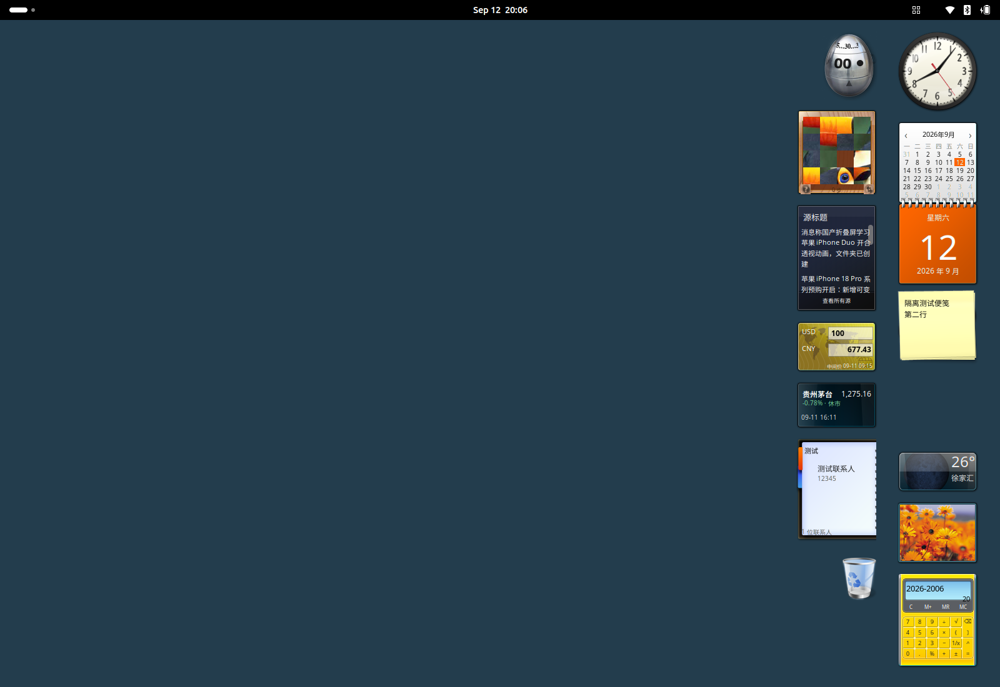

# Windows Vista/7 Widgets

[简体中文](README.md) | English

Windows Vista / 7-style widgets for the GNOME desktop.

There are 14 widgets: Clock, Calendar, CPU / Memory, Notes, Weather, Slide Show, Calculator, Timer, Picture Puzzle, RSS Feeds, Currency Converter, Stocks, Contacts and Trash. Choose between Classic and Fluent skins.



## Install and update

You need Python 3, Node.js, gettext, and a GNOME environment with GJS, GTK4 and libadwaita. Run these commands from the project root. Do not run the installer with `sudo`:

```bash
sudo apt install gettext
python3 scripts/install.py
```

The installer uses your user extension directory and backs up any existing version. After an update, save your work, log out and log back in; disabling and re-enabling may still use the old code. The installer will not log you out or restart the desktop.

If the extension is not enabled after login, run:

```bash
gnome-extensions enable classic-gadgets@FreeDivers.github.io
```

To uninstall, run `python3 scripts/uninstall.py`. Personal data, including notes, contacts and layouts, is kept.

## Use

Clock, Calendar, CPU / Memory and Notes are enabled by default.

- Open “Add Widgets…” from the top-bar menu or the desktop context menu. Double-click a widget to add it, or drag it onto the desktop.
- Drag a blank area or the handle on the right to move a widget. Click its gear to open its settings. The widget's context menu has size, opacity and position-lock options.
- Switch skins under “Appearance” in the top-bar menu. Positions, settings and notes are saved automatically.

On Ubuntu, the desktop context-menu entry uses DING integration without changing system extension files. You can turn off “Desktop context menu” in the extension settings.


## Development

From the project root, run:

```bash
npm test
npm run build
```

The package is written to `dist/`. Further records (in Chinese): [feature verification](docs/verification.md), [network verification](docs/network-region-verification.md), [typography](docs/typography-verification.md) and [asset research](docs/source-research.md).

## License

The new adapter code and documentation use the [MIT license](LICENSE). Microsoft and Rectify11 skin assets are not covered by MIT. Packages containing those assets are for local testing; check the relevant permissions before distributing them. See the [asset notice](ASSET-NOTICE.md) (in Chinese).
