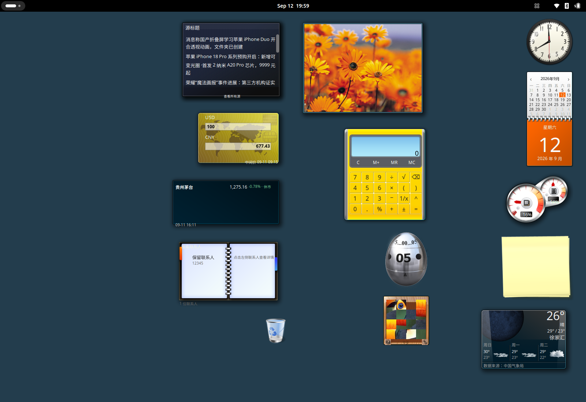

# Windows Vista/7 小组件

简体中文 | [English](README.en.md)

把 Windows Vista / 7 风格的小组件放到 GNOME 桌面上。外观使用原版皮肤图片，功能由 GNOME 扩展实现，不需要 Wine，也不运行旧版 Windows 脚本。目前适用于 Ubuntu 26.04、GNOME Shell 50、Wayland。

共有 14 个组件：时钟、日历、CPU / 内存、便笺、天气、幻灯片、计算器、计时器、图片拼图、RSS、货币换算、股票、联系人和回收站。提供经典和 Fluent 两种外观；没有 Fluent 素材的组件仍使用经典皮肤。



## 安装和更新

需要 Python 3、Node.js、gettext，以及 GNOME 的 GJS、GTK4 / libadwaita 环境。在项目根目录运行，安装脚本不要加 `sudo`：

```bash
sudo apt install gettext
python3 scripts/install.py
```

扩展会安装到当前用户目录，已有版本会先备份。更新后请保存工作，注销并重新登录；只禁用再启用可能仍会使用旧代码。安装脚本不会替你注销或重启桌面。

如果登录后没有启用，运行：

```bash
gnome-extensions enable classic-gadgets@qinyan.local
```

卸载用 `python3 scripts/uninstall.py`，便笺、联系人和布局等个人数据会保留。

## 怎么用

默认显示时钟、日历、CPU / 内存和便笺。

- 从顶栏菜单或桌面右键菜单打开「添加小组件…」，双击添加，也可以拖到桌面。
- 拖动组件空白处或右侧拖动柄来移动，点击齿轮修改该组件的设置。右键菜单里可以调整大小、不透明度或锁定位置。
- 在顶栏「外观」中切换皮肤。组件位置、设置和便笺内容会自动保存。
- 文件拖入回收站组件后会移到系统回收站；清空时需要另行确认。

Ubuntu 的桌面右键入口通过 DING 集成，不修改系统扩展文件。可在扩展设置中关闭「桌面右键菜单」。

## 语言

界面跟随系统语言，目前提供简体中文和英文，没有对应翻译时显示英文。切换语言不会改动便笺、联系人等个人内容，也不决定网络数据源。

中文文案在 [`po/zh_CN.po`](po/zh_CN.po)。修改译文或添加语言，请看[翻译说明](docs/i18n.md)。

## 联网说明

天气、股票、汇率和 RSS 需要联网，不需要账号或 API Key。扩展每次启用时会通过 IP 粗略判断网络地区，选择中国气象局、东方财富、IT之家，或 Open-Meteo、Yahoo Finance、Frankfurter / ECB、BBC News 等来源。自定义 RSS 地址不变。

地区检测不会自动修改天气城市，也不保存 IP 或原始定位响应。天气的「定位当前位置」需要主动点击。代理和 VPN 可能影响检测结果。

网络出错时显示错误，或显示带时间的缓存数据。公开接口可能限流或变更；股票和汇率仅供参考，不作为交易依据。

## 开发

在项目根目录运行：

```bash
npm test
npm run build
```

安装包生成在 `dist/`。更多记录：[功能验证](docs/verification.md)、[网络验证](docs/network-region-verification.md)、[字体排版](docs/typography-verification.md)、[素材考证](docs/source-research.md)。

## 许可

新写的适配代码和文档采用 [MIT 许可证](LICENSE)。微软及 Rectify11 的皮肤素材不在 MIT 范围内；含素材的安装包用于本机测试，公开分发前需核实授权。详见[素材来源与许可](ASSET-NOTICE.md)。
